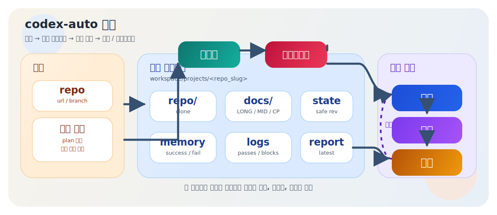
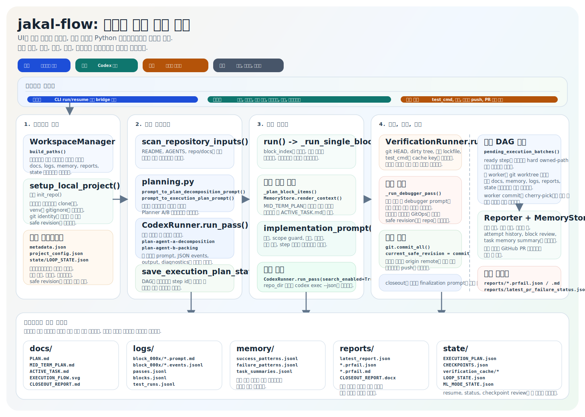

# jakal-flow (한국어)

`jakal-flow`는 격리된 워크스페이스 안에서 여러 저장소를 관리하면서, 각 저장소별 계획, 로그, 메모리, 리포트, 롤백 상태를 분리해 유지하는 Codex 기반 Python CLI 및 데스크톱 셸입니다. 단일 저장소 안에 모든 상태를 몰아넣지 않고, 관리 대상 저장소마다 추적 가능한 자동화 루프를 유지하는 데 초점을 둡니다.

영문 문서는 [README.md](README.md)를 참고하세요.

## 흐름

전체 구조와 워크스페이스 격리 흐름:



백엔드 계획 생성, 실행, 검증, 롤백, 리포트 흐름:



## 핵심 특징

- `projects/<repo_slug>/` 단위의 다중 저장소 워크스페이스 관리
- Python 오케스트레이터 위에 React + Tauri 데스크톱 셸 제공
- OpenAI / Codex 클라우드, OpenRouter, OpenCDK, 로컬 OpenAI 호환 서버, Codex OSS 로컬 실행 지원
- 표준 소프트웨어 워크플로와 ML 실험 워크플로 지원
- owned path 기반 안전 조건을 둔 병렬 DAG 실행
- 계획, 체크포인트, 로그, 메모리, 리포트, SVG, UI 이벤트 히스토리를 프로젝트별로 분리 저장
- 로컬 공유 서버와 읽기 전용 모니터링 링크, 선택적 공개 URL, Cloudflare Quick Tunnel 연동

## 프로젝트 레이아웃

```text
workspace_root/
  projects/
    <repo_slug>/
      repo/
      docs/
      memory/
      logs/
      reports/
      state/
      metadata.json
      project_config.json
```

## 설치

```bash
python3 -m venv .venv
source .venv/bin/activate
python -m pip install -e .
```

이 저장소 문서는 Linux 개발 환경을 기준으로 작성합니다.

- 예시는 `python3`, `source .venv/bin/activate`, POSIX 셸 명령을 사용합니다.
- 데스크톱 UI 개발에는 Node.js 20+, Rust, 그리고 배포판에 맞는 Tauri용 WebKitGTK 또는 GTK 계열 시스템 패키지가 필요합니다.
- Windows에서는 아래 명령을 그대로 복붙하기보다 PowerShell 또는 CMD 문법에 맞게 바꿔서 실행해야 합니다.

## 자주 쓰는 명령
설치 후 다음 엔트리포인트를 사용할 수 있습니다.

- `jakal-flow`
- `jakal-flow-ui-bridge`

## 데스크톱 UI

데스크톱 셸은 `desktop/` 아래에 있으며, `python -m jakal_flow.ui_bridge`를 통해 기존 Python 백엔드를 그대로 사용합니다.

개발 환경 요구사항:

- Node.js 20+
- Rust toolchain 및 OS별 Tauri 선행조건
- `PATH`에 잡힌 Python 3.11+ 또는 `JAKAL_FLOW_PYTHON`

개발 실행:

```bash
cd desktop
npm.cmd install
npm.cmd run test
npm.cmd run tauri:dev
```

빌드:

```bash
cd desktop
npm.cmd run tauri:build
```

데스크톱 앱의 주요 기능:

- 관리 프로젝트 등록, 런타임 설정 저장, 요약 상태 확인
- 모델 프리셋 및 제공자 선택, OSS 로컬 모델 탐색
- 계획 생성, 단계 편집, stop-after-step 요청, closeout 실행
- 비용 및 시간 추정 패널과 Codex 사용량 기반 대시보드
- 읽기 전용 공유 링크 생성 및 철회

## 런타임 지원

현재 구현에 연결된 제공자 프리셋:

- `openai`
- `openrouter`
- `opencdk`
- `local_openai`
- `oss`

로컬 OSS 제공자:

- `ollama`
- `lmstudio`

워크플로 모드:

- `standard`
- `ml`

실행 모드는 현재 CLI와 데스크톱 모두 병렬 DAG 스케줄러로 정규화됩니다.

## 공유 뷰어

읽기 전용 모니터링 링크는 로컬 Python 공유 서버를 기반으로 하며, 오케스트레이션과 외부 노출을 분리합니다.

1. 데스크톱 앱을 실행합니다.
2. 관리 프로젝트를 엽니다.
3. 공유 bind host와 선택적 public base URL을 설정합니다.
4. share link를 생성합니다.
5. `public_base_url`이 비어 있고 `cloudflared`가 설치되어 있으면 임시 Cloudflare Quick Tunnel을 자동으로 시작할 수 있습니다.
6. 생성된 링크를 다른 브라우저나 기기에서 엽니다.
7. 사용이 끝나면 데스크톱 UI에서 세션을 철회합니다.

공유 페이지에는 마스킹된 상태, 현재 작업, 최근 로그, 최신 테스트 결과, 마지막 갱신 시각이 표시됩니다.

## CLI 예시

관리 저장소 초기화와 첫 계획 생성:

```bash
python -m jakal_flow init-repo \
  --repo-url https://github.com/Ahnd6474/lit.git \
  --branch main \
  --workspace-root .jakal-flow-workspace \
  --model gpt-5.4 \
  --effort high \
  --plan-prompt "완성도 높은 결과물과 강한 검증, 마감 정리를 목표로 안전한 프로젝트 계획을 만들어라." \
  --approval-mode never \
  --sandbox-mode workspace-write \
  --test-cmd "python -m pytest"
```

표준 개선 블록 2회 실행과 Word closeout 리포트 생성:

```bash
python -m jakal_flow run \
  --repo-url https://github.com/Ahnd6474/lit.git \
  --branch main \
  --workspace-root .jakal-flow-workspace \
  --model gpt-5.4 \
  --effort high \
  --word-report \
  --approval-mode never \
  --sandbox-mode workspace-write \
  --test-cmd "python -m pytest" \
  --max-blocks 2
```

Codex OSS + 로컬 제공자 실행:

```bash
python -m jakal_flow run \
  --repo-url https://github.com/Ahnd6474/lit.git \
  --branch main \
  --workspace-root .jakal-flow-workspace \
  --model-provider oss \
  --local-model-provider ollama \
  --model qwen2.5-coder:0.5b \
  --effort medium \
  --approval-mode never \
  --sandbox-mode workspace-write \
  --test-cmd "python -m pytest" \
  --max-blocks 1
```

OpenRouter 같은 OpenAI 호환 엔드포인트 실행:

```bash
python -m jakal_flow run \
  --repo-url https://github.com/Ahnd6474/lit.git \
  --branch main \
  --workspace-root .jakal-flow-workspace \
  --model-provider openrouter \
  --provider-base-url https://openrouter.ai/api/v1 \
  --provider-api-key-env OPENROUTER_API_KEY \
  --billing-mode token \
  --model openai/gpt-4.1-mini \
  --effort medium \
  --approval-mode never \
  --sandbox-mode workspace-write \
  --test-cmd "python -m pytest" \
  --max-blocks 1
```

로컬 OpenAI 호환 서버 실행:

```bash
python -m jakal_flow run \
  --repo-url https://github.com/Ahnd6474/lit.git \
  --branch main \
  --workspace-root .jakal-flow-workspace \
  --model-provider local_openai \
  --provider-base-url http://127.0.0.1:1234/v1 \
  --model llama-3.1-8b-instruct \
  --effort medium \
  --approval-mode never \
  --sandbox-mode workspace-write \
  --test-cmd "python -m pytest" \
  --max-blocks 1
```

ML 워크플로와 자동 cycle 재계획:

```bash
python -m jakal_flow run \
  --repo-url https://github.com/Ahnd6474/lit.git \
  --branch main \
  --workspace-root .jakal-flow-workspace \
  --model gpt-5.4 \
  --effort high \
  --workflow-mode ml \
  --ml-max-cycles 3 \
  --approval-mode never \
  --sandbox-mode workspace-write \
  --test-cmd "python -m pytest" \
  --max-blocks 6
```

기존 관리 저장소 재개:

```bash
python -m jakal_flow resume \
  --repo-url https://github.com/Ahnd6474/lit.git \
  --branch main \
  --workspace-root .jakal-flow-workspace \
  --model gpt-5.4 \
  --effort high \
  --approval-mode never \
  --sandbox-mode workspace-write \
  --test-cmd "python -m pytest" \
  --max-blocks 1
```

관리 저장소와 리포트 확인:

```bash
python -m jakal_flow list-repos --workspace-root .jakal-flow-workspace
python -m jakal_flow status --repo-url https://github.com/Ahnd6474/lit.git --branch main --workspace-root .jakal-flow-workspace
python -m jakal_flow history --repo-url https://github.com/Ahnd6474/lit.git --branch main --workspace-root .jakal-flow-workspace --limit 20
python -m jakal_flow report --repo-url https://github.com/Ahnd6474/lit.git --branch main --workspace-root .jakal-flow-workspace
cd desktop
npm install
npm run tauri:dev
```

Linux 데스크톱 패키지 빌드:

```bash
cd desktop
npm install
npm run tauri build
```

Linux 번들 결과물은 `desktop/src-tauri/target/release/bundle/` 아래에 생성됩니다. 일반적인 Linux 환경에서는 `.deb`, `.rpm`이 만들어지고, 호스트 도구가 갖춰져 있으면 AppImage도 함께 생성될 수 있습니다.

프론트엔드 화면만 빠르게 확인하려면:

```bash
cd desktop
npm install
npm run dev
```

## Linux 빠른 시작

가상환경을 만들고 패키지를 설치한 뒤, 워크스페이스를 초기화하고 실행하면 됩니다.

```bash
python3 -m venv .venv
source .venv/bin/activate
python -m pip install -e .

jakal-flow init-repo \
  --repo-url https://github.com/Ahnd6474/lit.git \
  --branch main \
  --workspace-root .jakal-flow-workspace \
  --model gpt-5.4 \
  --effort high \
  --approval-mode never \
  --sandbox-mode workspace-write \
  --test-cmd "python -m pytest"

jakal-flow run \
  --repo-url https://github.com/Ahnd6474/lit.git \
  --branch main \
  --workspace-root .jakal-flow-workspace \
  --model gpt-5.4 \
  --effort high \
  --approval-mode never \
  --sandbox-mode workspace-write \
  --test-cmd "python -m pytest" \
  --max-blocks 2
```

## 동작 방식

초기화 단계:

1. 워크스페이스 아래에 격리된 프로젝트 디렉터리를 만듭니다.
2. 대상 저장소를 `repo/`에 클론하거나 갱신합니다.
3. `README.md`, `AGENTS.md`, `repo/docs/**`를 스캔합니다.
4. 저장소 문서만으로 판단이 어려우면 `src/jakal_flow/docs/REFERENCE_GUIDE.md`를 참고 기준으로 사용합니다.
5. `docs/PLAN.md`, `docs/SCOPE_GUARD.md`, `docs/MID_TERM_PLAN.md`, 메모리 파일, 루프 상태를 준비합니다.
6. 체크포인트 타임라인을 만들고 현재 safe revision을 기록합니다.

실행 블록마다:

1. 저장된 계획과 메모리 문맥을 불러옵니다.
2. 저장 계획에서 mid-term subset을 다시 만듭니다.
3. 실행 계획을 생성하거나 갱신합니다.
4. 의존성이 충족된 단계를 병렬 스케줄러로 실행합니다.
5. 검증을 수행하고, 저장소 상태와 테스트 fingerprint가 완전히 같으면 캐시된 성공 결과를 재사용합니다.
6. 검증된 안전한 변경만 커밋합니다.
7. 회귀나 병합 충돌 시 마지막 safe revision으로 되돌립니다.
8. 로그, 리포트, SVG, 리뷰 문서, 메모리를 갱신합니다.
9. `--allow-push`가 켜져 있고 `origin`이 설정되어 있으면 검증된 커밋을 푸시할 수 있습니다.

## 프로젝트별 산출물

관리 프로젝트마다 다음과 같은 파일이 생성되거나 유지될 수 있습니다.

- `docs/PLAN.md`
- `docs/MID_TERM_PLAN.md`
- `docs/SCOPE_GUARD.md`
- `docs/ACTIVE_TASK.md`
- `docs/BLOCK_REVIEW.md`
- `docs/CHECKPOINT_TIMELINE.md`
- `docs/CLOSEOUT_REPORT.md`
- `docs/EXECUTION_FLOW.svg`
- `docs/ML_EXPERIMENT_REPORT.md`
- `docs/ML_EXPERIMENT_RESULTS.svg`
- `docs/RESEARCH_NOTES.md`
- `docs/attempt_history.md`
- `memory/success_patterns.jsonl`
- `memory/failure_patterns.jsonl`
- `memory/task_summaries.jsonl`
- `logs/passes.jsonl`
- `logs/blocks.jsonl`
- `logs/test_runs.jsonl`
- `logs/ui_events.jsonl`
- `reports/latest_report.json`
- `reports/*pr_failure.json`
- `reports/*pr_failure.md`
- `reports/latest_pr_failure_status.json`
- `state/LOOP_STATE.json`
- `state/CHECKPOINTS.json`
- `state/ML_MODE_STATE.json`
- `state/ML_STEP_REPORT.json`
- `state/UI_RUN_CONTROL.json`
- `state/ml_experiments/*.json`
- `state/share_sessions.json`
- `state/verification_cache/*.json`
- `metadata.json`
- `project_config.json`

## 참고

- `codex exec`는 비대화형으로 호출되며 JSON 이벤트 스트림은 `logs/block_*/` 아래에 저장됩니다.
- 로컬 OSS 실행도 Codex CLI를 통해 수행됩니다.
- 데스크톱 브리지는 Windows에서 UTF-8 stdio를 강제해 JSON과 한글 텍스트가 깨지지 않도록 처리합니다.
- CLI 기본값은 보수적으로 유지됩니다. `--max-blocks` 기본값은 `1`이고, 푸시는 `--allow-push`를 명시해야 합니다.
