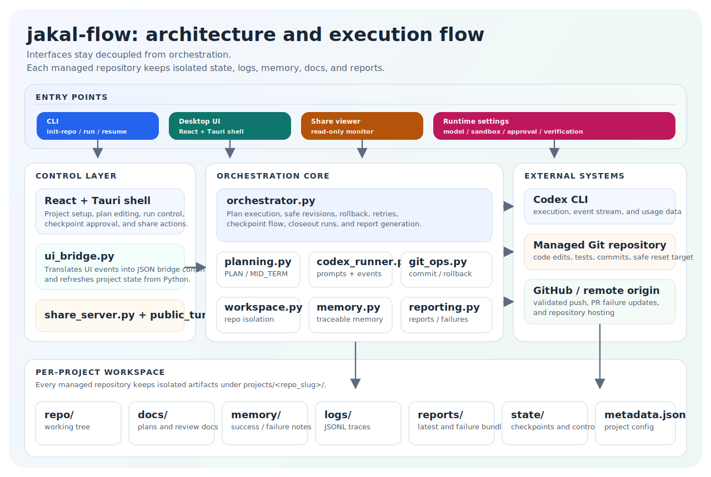
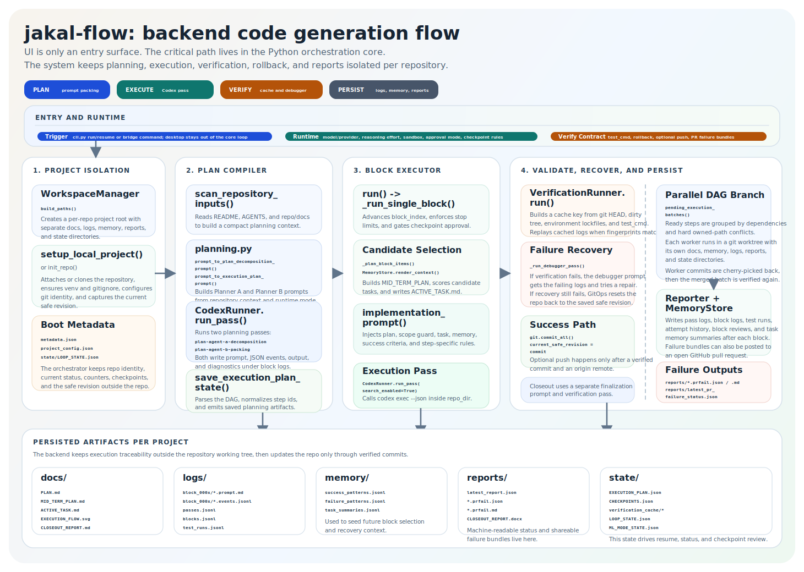

# jakal-flow

<p align="center">
  <strong>Traceable multi-repository Codex automation with a Python-first CLI and a React + Tauri desktop shell.</strong>
</p>

<p align="center">
  Run safe, repeatable Codex improvement loops across multiple repositories without mixing plans, logs, memory, reports, rollback state, or share sessions.
</p>

<p align="center">
  <a href="https://github.com/Ahnd6474/Jakal-flow/stargazers"></a>
  <a href="https://github.com/Ahnd6474/Jakal-flow/issues"></a>
  <a href="https://github.com/Ahnd6474/Jakal-flow/commits/main"></a>
  
  
  
</p>

<p align="center">
  <a href="#quick-start">Quick Start</a> &middot;
  <a href="#what-it-supports">What It Supports</a> &middot;
  <a href="#desktop-ui">Desktop UI</a> &middot;
  <a href="#configuration">Configuration</a> &middot;
  <a href="#how-it-works">How It Works</a> &middot;
  <a href="#star-history">Star History</a> &middot;
  <a href="README.ko.md">Korean Guide</a>
</p>

`jakal-flow` is built for long-running repository automation, not one-off patches. It manages isolated per-project workspaces, generates and executes plans, preserves safe revisions, records structured history, and lets you supervise runs from either the CLI or the desktop app.

If you want to run the same Codex-driven workflow across several repositories while keeping every project's plan, checkpoints, logs, memory, reports, and rollback state separate, this is the tool.

## Architecture

High-level surfaces and isolated workspace layout:



Backend planning, execution, verification, rollback, and reporting flow:



## Quick Start

Recommended runtime:

- Python 3.11+
- Codex CLI available on `PATH`
- For the desktop shell: Node.js 20+, Rust, and Tauri prerequisites

Install the Python package in editable mode:

```bash
python -m pip install -e .
```

That installs:

- `jakal-flow`
- `jakal-flow-ui-bridge`

Initialize a managed repository:

```bash
python -m jakal_flow init-repo \
  --repo-url https://github.com/Ahnd6474/lit.git \
  --branch main \
  --workspace-root .jakal-flow-workspace \
  --model gpt-5.4 \
  --effort high \
  --plan-prompt "Build a safe project plan aimed at a finished, well-integrated result with strong verification and closeout." \
  --approval-mode never \
  --sandbox-mode workspace-write \
  --test-cmd "python -m pytest"
```

Run a verified improvement loop:

```bash
python -m jakal_flow run \
  --repo-url https://github.com/Ahnd6474/lit.git \
  --branch main \
  --workspace-root .jakal-flow-workspace \
  --model gpt-5.4 \
  --effort high \
  --approval-mode never \
  --sandbox-mode workspace-write \
  --test-cmd "python -m pytest" \
  --max-blocks 2
```

Inspect progress later:

```bash
python -m jakal_flow list-repos --workspace-root .jakal-flow-workspace
python -m jakal_flow status --repo-url https://github.com/Ahnd6474/lit.git --branch main --workspace-root .jakal-flow-workspace
python -m jakal_flow history --repo-url https://github.com/Ahnd6474/lit.git --branch main --workspace-root .jakal-flow-workspace --limit 20
python -m jakal_flow report --repo-url https://github.com/Ahnd6474/lit.git --branch main --workspace-root .jakal-flow-workspace
```

Open the desktop shell in development:

```bash
cd desktop
npm.cmd install
npm.cmd run test
npm.cmd run tauri:dev
```

## Why jakal-flow

- Multi-repository by design: every managed repository gets its own isolated workspace subtree.
- Traceability first: plans, checkpoints, UI events, test runs, block logs, reports, SVG summaries, and memory files are persisted.
- Safe execution: safe revisions, rollback, checkpoint review, and verified-only commit flow stay in the core loop.
- One backend, two surfaces: use the CLI directly or supervise the same Python backend through the desktop shell.
- Flexible model routing: run the workflow through OpenAI/Codex cloud, Claude Code, Gemini CLI, OpenAI-compatible providers, or local OSS backends.

## What It Supports

### Surfaces

| Surface | Supported |
| --- | --- |
| CLI | `init-repo`, `run`, `resume`, `list-repos`, `status`, `history`, `report` |
| Desktop UI | React + Tauri shell over `python -m jakal_flow.ui_bridge` |
| Remote monitor | Local share server, temporary share sessions, masked live status, remote pause/resume controls, optional public base URL, optional automatic Cloudflare Quick Tunnel |

### Workflow Modes

| Capability | Supported |
| --- | --- |
| Standard software workflow | Yes |
| ML experiment workflow | Yes, via `--workflow-mode ml` |
| Automatic ML replanning | Yes, up to `--ml-max-cycles` |
| Execution mode | Parallel DAG scheduler is the normalized execution mode |
| Closeout pass | Yes, separate from normal planned steps |
| Stop-after-step | Yes, through the desktop run control |

### Model / Provider Support

| Provider preset | Supported | Notes |
| --- | --- | --- |
| `openai` | Yes | OpenAI / Codex cloud flow |
| `claude` | Yes | Claude Code print-mode flow |
| `gemini` | Yes | Gemini CLI headless flow |
| `openrouter` | Yes | OpenAI-compatible endpoint |
| `opencdk` | Yes | OpenAI-compatible endpoint |
| `local_openai` | Yes | Local OpenAI-compatible server such as LM Studio, vLLM, llama.cpp, or LocalAI |
| `oss` | Yes | Codex OSS mode through a local provider |

Local providers for `--model-provider oss`:

- `ollama`
- `lmstudio`

Reasoning effort levels:

- `low`
- `medium`
- `high`
- `xhigh`

### Planning and Execution

| Capability | Supported |
| --- | --- |
| Saved project plan generation | Yes |
| Mid-term subset regeneration | Yes |
| Dependency-aware execution tree | Yes |
| Per-step reasoning effort | Yes |
| Per-step success criteria | Yes |
| Per-step verification command overrides | Yes |
| Owned-path based parallel safety | Yes |
| Manual step editing before execution | Yes |
| Background polling from desktop UI | Yes |

### Safety, Review, and Recovery

| Capability | Supported |
| --- | --- |
| Safe revision capture | Yes |
| Rollback on regression | Yes |
| Verified-only commit flow | Yes |
| Optional push after safe runs | Yes, when `--allow-push` is enabled and `origin` exists |
| Checkpoint timeline | Yes |
| Checkpoint approval mode | Yes |
| Git conflict abort for unsafe parallel merges | Yes |
| PR-ready failure bundle generation | Yes |
| Optional PR failure reporting with GitHub token | Yes |

### Observability and Outputs

| Capability | Supported |
| --- | --- |
| JSONL pass logs | Yes |
| JSONL block logs | Yes |
| JSONL UI event logs | Yes |
| Verification run history | Yes |
| Verification cache replay | Yes |
| Execution flow SVG | Yes |
| ML experiment results SVG | Yes |
| Closeout markdown report | Yes |
| Word closeout report | Yes, with `--word-report` or desktop toggle |
| Runtime time/cost estimates | Yes |
| Codex usage aggregation | Yes |

### Share / Monitoring

| Capability | Supported |
| --- | --- |
| Local-only monitor link | Yes |
| Network-ready bind mode (`0.0.0.0`) | Yes |
| Public base URL override | Yes |
| Automatic Cloudflare Quick Tunnel | Yes, and on Windows the app can auto-install `cloudflared` through `winget` when needed |
| Temporary session creation and revocation | Yes |
| Masked status / task / log viewer | Yes |
| Live updates with polling fallback | Yes |
| Remote pause / resume from shared monitor | Yes |

## Desktop UI

The desktop shell keeps the Python backend intact and adds a more user-friendly control layer for planning, execution, and monitoring.

What you can do from the desktop app:

- register and reopen managed projects with saved runtime settings
- choose model presets and provider defaults
- edit the project prompt and generate an execution tree
- inspect DAG layers, dependencies, owned paths, and per-step metadata
- run the plan, stop after the current step, and trigger closeout
- review estimated remaining time, estimated cost, actual recent cost, and Codex usage windows
- configure share links and copy or revoke remote monitor URLs
- toggle dashboard cards, theme, and UI language

Build the desktop app:

```bash
cd desktop
npm.cmd run tauri:build
```

Related files:

- [desktop/README.md](desktop/README.md)
- [website/README.md](website/README.md)

## Configuration

`jakal-flow` supports both CLI runtime options and desktop-managed defaults.

### CLI / Runtime Settings

| Group | Supported settings |
| --- | --- |
| Repository targeting | `--repo-url`, `--branch`, `--workspace-root`, `--plan-file`, `--resume` |
| Model selection | `--model-provider`, `--local-model-provider`, `--model`, `--effort`, `--fast` |
| Provider connection | `--provider-base-url`, `--provider-api-key-env` |
| Cost estimation | `--billing-mode`, `--input-cost-per-million-usd`, `--cached-input-cost-per-million-usd`, `--output-cost-per-million-usd`, `--reasoning-output-cost-per-million-usd`, `--per-pass-cost-usd` |
| Workflow control | `--workflow-mode`, `--ml-max-cycles`, `--max-blocks`, `--extra-prompt`, `--plan-prompt` |
| Optimization controls | `--optimization-mode`, `--optimization-large-file-lines`, `--optimization-long-function-lines`, `--optimization-duplicate-block-lines`, `--optimization-max-files` |
| Safety and validation | `--approval-mode`, `--sandbox-mode`, `--test-cmd`, `--allow-push` |
| Reporting | `--word-report` |

To inspect the latest command surface from your local checkout:

```bash
python -m jakal_flow --help
```

### Desktop-managed Defaults

The desktop shell additionally manages:

- `parallel_worker_mode` and `parallel_workers`
- `checkpoint_interval_blocks`
- `require_checkpoint_approval`
- `codex_path`
- dashboard visibility preferences
- UI theme and language
- share server bind host and public base URL

### Cost Modes

Supported billing estimation modes:

- `included`
- `token`
- `per_pass`

### Example Provider Setups

OpenRouter:

```bash
python -m jakal_flow run \
  --repo-url https://github.com/Ahnd6474/lit.git \
  --branch main \
  --workspace-root .jakal-flow-workspace \
  --model-provider openrouter \
  --provider-base-url https://openrouter.ai/api/v1 \
  --provider-api-key-env OPENROUTER_API_KEY \
  --billing-mode token \
  --model openai/gpt-4.1-mini \
  --effort medium \
  --approval-mode never \
  --sandbox-mode workspace-write \
  --test-cmd "python -m pytest" \
  --max-blocks 1
```

Gemini CLI:

```bash
python -m jakal_flow run \
  --repo-url https://github.com/Ahnd6474/lit.git \
  --branch main \
  --workspace-root .jakal-flow-workspace \
  --model-provider gemini \
  --model gemini-2.5-flash \
  --approval-mode never \
  --sandbox-mode workspace-write \
  --test-cmd "python -m pytest" \
  --max-blocks 1
```

Claude Code:

```bash
python -m jakal_flow run \
  --repo-url https://github.com/Ahnd6474/lit.git \
  --branch main \
  --workspace-root .jakal-flow-workspace \
  --model-provider claude \
  --model sonnet \
  --approval-mode never \
  --sandbox-mode workspace-write \
  --test-cmd "python -m pytest" \
  --max-blocks 1
```

Local OSS via Ollama:

```bash
python -m jakal_flow run \
  --repo-url https://github.com/Ahnd6474/lit.git \
  --branch main \
  --workspace-root .jakal-flow-workspace \
  --model-provider oss \
  --local-model-provider ollama \
  --model qwen2.5-coder:0.5b \
  --effort medium \
  --approval-mode never \
  --sandbox-mode workspace-write \
  --test-cmd "python -m pytest" \
  --max-blocks 1
```

Local OpenAI-compatible server:

```bash
python -m jakal_flow run \
  --repo-url https://github.com/Ahnd6474/lit.git \
  --branch main \
  --workspace-root .jakal-flow-workspace \
  --model-provider local_openai \
  --provider-base-url http://127.0.0.1:1234/v1 \
  --model llama-3.1-8b-instruct \
  --effort medium \
  --approval-mode never \
  --sandbox-mode workspace-write \
  --test-cmd "python -m pytest" \
  --max-blocks 1
```

ML workflow:

```bash
python -m jakal_flow run \
  --repo-url https://github.com/Ahnd6474/lit.git \
  --branch main \
  --workspace-root .jakal-flow-workspace \
  --model gpt-5.4 \
  --effort high \
  --workflow-mode ml \
  --ml-max-cycles 3 \
  --approval-mode never \
  --sandbox-mode workspace-write \
  --test-cmd "python -m pytest" \
  --max-blocks 6
```

## How It Works

### Short version

```text
CLI / Desktop UI / Share viewer
            |
            v
      Python orchestration core
            |
            +-- planning.py
            +-- codex_runner.py
            +-- git_ops.py
            +-- workspace.py
            +-- memory.py
            +-- reporting.py
            |
            v
  projects/<repo_slug>/
    repo/ docs/ memory/ logs/ reports/ state/
```

### Initialization

1. Create an isolated project directory under the workspace root.
2. Clone or update the target repository into `repo/`.
3. Scan `README.md`, `AGENTS.md`, and `repo/docs/**`.
4. Generate or refresh the saved plan and supporting guard documents.
5. Record the current safe revision and checkpoint timeline.

### Each run block

1. Load saved plan context and memory.
2. Rebuild the mid-term subset from the saved plan.
3. Generate or update the execution plan.
4. Run dependency-ready steps through the parallel scheduler.
5. Verify changes, reusing cached verification results when the fingerprint matches.
6. Commit only safe validated changes.
7. Roll back to the last safe revision on regression or unsafe merge outcomes.
8. Write logs, reports, SVG summaries, and memory updates.

## Workspace Layout

Every managed repository gets its own isolated subtree:

```text
workspace_root/
  projects/
    <repo_slug>/
      repo/
      docs/
      memory/
      logs/
      reports/
      state/
      metadata.json
      project_config.json
```

Key generated artifacts can include:

- `docs/PLAN.md`
- `docs/MID_TERM_PLAN.md`
- `docs/SCOPE_GUARD.md`
- `docs/ACTIVE_TASK.md`
- `docs/BLOCK_REVIEW.md`
- `docs/CHECKPOINT_TIMELINE.md`
- `docs/CLOSEOUT_REPORT.md`
- `docs/EXECUTION_FLOW.svg`
- `docs/ML_EXPERIMENT_REPORT.md`
- `docs/ML_EXPERIMENT_RESULTS.svg`
- `docs/RESEARCH_NOTES.md`
- `docs/attempt_history.md`
- `memory/success_patterns.jsonl`
- `memory/failure_patterns.jsonl`
- `memory/task_summaries.jsonl`
- `logs/passes.jsonl`
- `logs/blocks.jsonl`
- `logs/test_runs.jsonl`
- `logs/ui_events.jsonl`
- `reports/latest_report.json`
- `reports/*pr_failure.json`
- `reports/*pr_failure.md`
- `reports/latest_pr_failure_status.json`
- `state/LOOP_STATE.json`
- `state/CHECKPOINTS.json`
- `state/ML_MODE_STATE.json`
- `state/ML_STEP_REPORT.json`
- `state/UI_RUN_CONTROL.json`
- `state/ml_experiments/*.json`
- `state/share_sessions.json`
- `state/verification_cache/*.json`
- `metadata.json`
- `project_config.json`

## Notes

- `codex exec` is invoked non-interactively and JSON event streams are saved under `logs/block_*/`.
- Claude Code runs use print-mode JSON output and the same per-block trace files under `logs/block_*/`.
- Gemini CLI runs use headless JSON output and the same per-block trace files under `logs/block_*/`.
- Local OSS runs still go through Codex CLI rather than bypassing it.
- The desktop bridge forces UTF-8 stdio on Windows so JSON payloads and Korean text survive the bridge boundary.
- CLI defaults stay conservative: `--max-blocks` defaults to `1`, and pushing requires explicit `--allow-push`.

## Star History

<p align="center">
  <a href="https://www.star-history.com/#Ahnd6474/Jakal-flow&type=date&legend=top-left">
    
  </a>
</p>

<p align="center">
  If the chart does not render in your GitHub view, open it directly:
  <a href="https://www.star-history.com/#Ahnd6474/Jakal-flow&type=date&legend=top-left">Star History</a>
</p>
